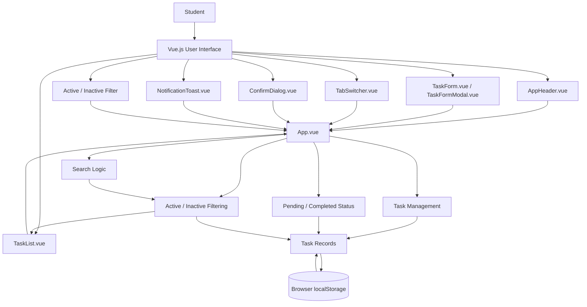
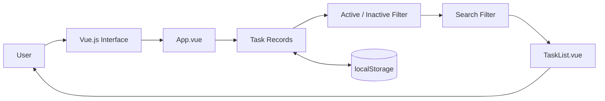
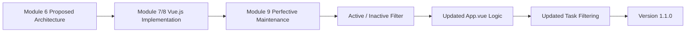

# Updated System Architectural Design

## 1. System Overview

The Student Task Management System is a Vue.js-based web application designed to help students organize and manage their academic tasks and deadlines. The system allows users to create, view, update, delete, search, complete, and restore task records through a responsive web interface.

For Module 9, the system will undergo a controlled software evolution through **Perfective Maintenance**. The approved change request is **CR-M9-01: Add Active/Inactive Record Filter**.

The new feature will allow users to filter task records according to their activity state while preserving the existing task management features.

The target version for this software evolution is **Version 1.1.0**.

---

## 2. Previous Architecture

The Module 6 architectural design proposed a three-tier client-server architecture consisting of:

1. Presentation Layer
2. Application Layer
3. Data Layer

The proposed technologies were:

* Vue.js for the Presentation Layer
* Node.js and Express for the Application Layer
* MongoDB Atlas Free for the Data Layer

The Module 7 implementation, however, was developed as a frontend Vue.js application using browser `localStorage` for data persistence. Therefore, the updated Module 9 architecture is based on the implemented system that is being evolved.

---

## 3. Updated Architectural Pattern

The current system uses a **component-based frontend architecture with browser-based local storage**.

The architecture consists of three main areas:

1. Presentation and UI Components
2. Application and Task Management Logic
3. Local Data Storage

The architecture separates user interface responsibilities, application logic, and data persistence while keeping the existing implementation simple and maintainable.

---

## 4. Architectural Components

### 4.1 Presentation and UI Components

The presentation layer uses Vue.js components to provide the user interface.

The components are responsible for displaying task information, collecting user input, providing task controls, displaying notifications, confirming actions, and supporting task navigation.

The main components are:

* `AppHeader.vue`
* `TaskForm.vue`
* `TaskFormModal.vue`
* `TaskList.vue`
* `TabSwitcher.vue`
* `ConfirmDialog.vue`
* `NotificationToast.vue`
* `AppFooter.vue`
* `AppIcon.vue`

---

### 4.2 Application and Task Management Logic

`App.vue` contains the main application state and task management logic.

It is responsible for:

* Loading task records
* Adding tasks
* Editing tasks
* Deleting tasks
* Completing and restoring tasks
* Searching tasks
* Calculating task counts
* Managing notifications
* Filtering task records
* Coordinating communication between components

For Module 9, `App.vue` will be extended to support the **Active/Inactive record filter**.

The new activity filter will be separate from the existing Pending/Completed task status.

---

### 4.3 Task List Component

`TaskList.vue` receives the filtered task records from `App.vue` and displays them to the user.

It currently displays:

* Task title
* Subject
* Priority
* Due date
* Overdue indication
* Completed status
* Complete/Restore controls
* Edit control
* Delete control

For Module 9, the component can also display the task's activity state if required by the updated interface.

The filtering logic remains primarily within `App.vue`, while `TaskList.vue` remains responsible for displaying the records it receives.

---

### 4.4 Local Data Storage

The system uses the browser's `localStorage` API to save task records.

The current storage key is:

```text
module7-task-records
```

The same storage mechanism will be retained for Version 1.1.0.

Existing records must remain accessible after the software evolution.

---

## 5. Component Responsibilities

| Component               | Technology  | Responsibility                                                                            |
| ----------------------- | ----------- | ----------------------------------------------------------------------------------------- |
| `App.vue`               | Vue.js      | Manages application state, task operations, search, counts, and Active/Inactive filtering |
| `AppHeader.vue`         | Vue.js      | Displays the application header                                                           |
| `TaskForm.vue`          | Vue.js      | Collects task information and performs validation                                         |
| `TaskFormModal.vue`     | Vue.js      | Provides the modal interface for adding and editing tasks                                 |
| `TaskList.vue`          | Vue.js      | Displays filtered task records, task details, priority, due dates, and task controls      |
| `TabSwitcher.vue`       | Vue.js      | Provides navigation between ongoing and completed task views                              |
| `ConfirmDialog.vue`     | Vue.js      | Confirms delete operations                                                                |
| `NotificationToast.vue` | Vue.js      | Displays system notifications                                                             |
| `AppFooter.vue`         | Vue.js      | Displays application footer information                                                   |
| `AppIcon.vue`           | Vue.js      | Provides reusable interface icons                                                         |
| `localStorage`          | Browser API | Stores and retrieves task records                                                         |

---

## 6. Updated System Architecture Diagram



---

## 7. Task Record Data Flow

The updated task data flow is:



This flow allows the new activity filter and existing search functionality to work together before the final task records are displayed.

---

## 8. Active/Inactive Filter

The Module 9 change introduces an activity filter with three possible views:

### All

Displays both active and inactive task records.

### Active

Displays only records marked as active.

### Inactive

Displays only records marked as inactive.

The activity filter is separate from the existing task status.

For example, a task may have:

```text
Activity: Active
Status: Pending
```

or:

```text
Activity: Inactive
Status: Completed
```

This prevents the new Active/Inactive feature from replacing or interfering with the existing Pending/Completed functionality.

---

## 9. Search and Filter Interaction

The existing search feature searches task titles and subjects.

In Version 1.1.0, the Active/Inactive filter will work together with the search feature.

For example:

```text
Filter: Active
Search: Mathematics
```

The system should display only active task records that match the search term.

Similarly:

```text
Filter: Inactive
Search: Science
```

The system should display only inactive Science-related task records.

When the filter is set to **All**, the search should operate across both active and inactive records.

---

## 10. Existing Task Status

The current system already uses task status to distinguish between ongoing and completed tasks.

The existing statuses are:

* `Pending`
* `Completed`

The existing functionality will remain unchanged.

The new Active/Inactive state represents a separate concept from task completion.

Therefore:

```text
Activity Status
    Active
    Inactive

Task Status
    Pending
    Completed
```

This separation allows both features to operate independently.

---

## 11. Data and Backward Compatibility

The system currently stores task records using:

```text
module7-task-records
```

Older records may not contain the new activity state because the Active/Inactive feature is introduced in Version 1.1.0.

The updated application must handle these older records safely.

When older records are loaded:

1. The application reads the existing records from localStorage.
2. It checks whether the activity information exists.
3. If the activity information is missing, the application assigns an appropriate default state.
4. The existing record remains available to the user.
5. The record can continue to be edited or deleted.

Existing records must not be automatically deleted because of the new feature.

---

## 12. Add and Edit Data Flow

### Add Task

1. The student opens the Add Task form.
2. The student enters the task information.
3. `TaskForm.vue` validates the required fields.
4. The task information is sent to `App.vue`.
5. `App.vue` creates the task record.
6. The activity state is assigned.
7. The record is saved to localStorage.
8. The updated task list is displayed.

### Edit Task

1. The student selects an existing task.
2. The task information is loaded into the edit form.
3. The student updates the information.
4. `TaskForm.vue` validates the changes.
5. `App.vue` updates the task record.
6. The updated record is saved to localStorage.
7. The task list is refreshed.

---

## 13. Delete and Completion Data Flow

### Delete Task

1. The student selects the delete button.
2. `ConfirmDialog.vue` asks the user to confirm the operation.
3. `App.vue` removes the selected record.
4. The updated task list is saved to localStorage.
5. A notification is displayed.

### Complete or Restore Task

1. The student selects Complete or Restore.
2. `TaskList.vue` emits the corresponding event.
3. `App.vue` updates the task's Pending/Completed status.
4. The updated record is saved to localStorage.
5. The task list is updated.

The Active/Inactive state remains separate from this process.

---

## 14. Testing Architecture

The system uses the following testing technologies:

* Vitest
* Vue Test Utils
* jsdom

The existing Module 8 tests will be retained for regression testing.

Module 9 will introduce additional automated tests for the Active/Inactive filter.

At least two new automated tests will verify:

1. Active filtering displays only active records.
2. Inactive filtering displays only inactive records.

Additional testing will verify that the new filter does not break the existing task management functionality.

---

## 15. Manual Testing

The updated system will retain the previous manual test cases and add new cases for the Module 9 feature.

The new testing will cover:

* Displaying all records
* Displaying active records
* Displaying inactive records
* Searching active records
* Searching inactive records
* Handling no matching records
* Loading older records
* Adding records
* Editing records
* Deleting records
* Completing and restoring records
* Responsive behavior

The total manual test coverage will meet the Module 9 requirement of at least 12 test cases.

---

## 16. GitHub Actions and Build

The existing GitHub Actions workflow will continue to verify the application.

The workflow will:

1. Check out the repository.
2. Install project dependencies.
3. Run automated tests.
4. Build the Vue.js application.

The required commands are:

```text
npm run test:run
npm run build
```

Successful execution confirms that the updated system passes automated tests and can be built successfully.

---

## 17. Responsive Design

The Active/Inactive filter will be integrated into the existing responsive interface.

The updated interface will be checked at:

* Desktop width
* Mobile width

The new filter must remain accessible and usable without causing layout problems.

Existing responsive task-list behavior will also be preserved.

---

## 18. Architecture Evolution

The architectural evolution from the previous version can be represented as:



The change extends the existing application rather than replacing its entire architecture.

---

## 19. Design Justification

The updated architecture is appropriate because it builds upon the existing Vue.js implementation and introduces only the components and logic required for the requested software evolution.

The Active/Inactive filter is implemented as an extension of the existing task management and filtering logic. This minimizes changes to unrelated components.

The existing Pending/Completed task status is preserved because it represents task completion, while Active/Inactive represents record activity. Keeping these concepts separate prevents conflicts between the existing and new features.

The existing localStorage implementation is also retained to preserve existing records and support backward compatibility.

The architecture continues to support automated testing through Vitest and Vue Test Utils and continuous verification through GitHub Actions.

---

## 20. Architectural Impact Summary

| Area                | Impact | Change                                                 |
| ------------------- | ------ | ------------------------------------------------------ |
| `App.vue`           | High   | Add Active/Inactive filtering logic                    |
| `TaskList.vue`      | Medium | Display filtered records and optionally activity state |
| `TaskForm.vue`      | Low    | Support activity state when required                   |
| `TaskFormModal.vue` | Low    | Maintain compatibility with task activity data         |
| Search              | Medium | Work together with Active/Inactive filtering           |
| Task Status         | Low    | Pending/Completed functionality remains unchanged      |
| localStorage        | High   | Support new activity information and older records     |
| Testing             | High   | Add Module 9 automated and manual tests                |
| GitHub Actions      | Medium | Verify tests and build                                 |
| Responsive UI       | Medium | Verify new filter at desktop and mobile widths         |

---

## 21. Architectural Limitations

The current implementation remains a frontend-based Vue.js application and uses browser localStorage for data persistence.

The Node.js, Express, and MongoDB Atlas architecture proposed in Module 6 has not been implemented in the current version.

Future improvements may include:

* Backend API integration
* MongoDB database integration
* User authentication
* Multi-user support
* Cloud-based data storage
* Advanced filtering and sorting

These improvements are outside the scope of CR-M9-01.

---

## 22. Version Information

**Previous Version:** Module 7/8 Student Task Management System

**Change Request:** CR-M9-01 – Add Active/Inactive Record Filter

**Maintenance Type:** Perfective Maintenance

**Target Version:** 1.1.0

**Frontend:** Vue.js

**Storage:** Browser localStorage

**Testing:** Vitest, Vue Test Utils, jsdom

**CI:** GitHub Actions
